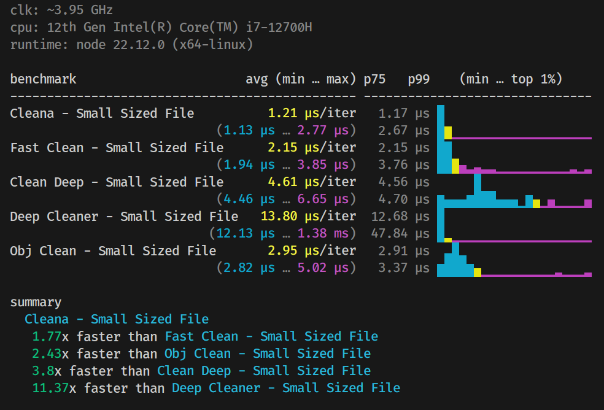

# 🧼 Cleana

<!-- automd:badges color=yellow -->

[](https://npmjs.com/package/cleana)
[](https://npm.chart.dev/cleana)

<!-- /automd -->

Clean JavaScript Objects and Arrays, recursively. Lightweight and Fast.

Cleana efficiently sanitize both JavaScript Objects and Arrays by removing unwanted values such as `undefined`, `NaN`, empty objects `{}` and empty arrays `[]`.

## Install

Install package:

<!-- automd:pm-install -->

```sh
npm install cleana
```
## Usage

```ts
import { cleana, CleanaOptions } from "cleana"

const object: CleanaOptions = {
	array: [],
	object: {},
	string: "",
	nan: Number.NaN,
	und: undefined,
	value: "123",
	nested: {
		arr: ["", [], {}],
		obj: { key: {}, key2: [] },
		nestedValue: "456"
	}
}

cleanDeep(object)

// Output:
//
// {
//   value: "123",
//   nested: {
//     nestedValue: "456",
//   },
// }
```

## Configuration

Cleana takes argument object of type `CleanaOptions`:

| Option          | Type          | Description                                                             | Default  |
|-----------------|---------------|-------------------------------------------------------------------------|----------|
| `cleanArray`    | `boolean`     | Remove empty arrays, e.g., `[]`                                        | `true`   |
| `cleanObject`   | `boolean`     | Remove empty objects, e.g., `{}`                                       | `true`   |
| `cleanNull`     | `boolean`     | Remove null values                                                      | `true`   |
| `cleanUndefined`| `boolean`     | Remove undefined values                                                 | `true`   |
| `cleanString`   | `boolean`     | Remove empty strings, e.g., `""`                                       | `true`   |
| `cleanNaN`      | `boolean`     | Remove NaN values                                                      | `true`   |
| `removeKeys`    | `string[]`    | Forcefully remove keys, e.g., `["key1", "key2"]`                      | `[]`     |
| `inPlace`       | `boolean`     | Create a new object that is cleaned or mutate the object passed to it & clean in place | `false`  |

## What makes this library unique

Cleana is built on the work of [`fast-clean`](https://github.com/Youssef93/fast-clean), [`clean-deep`](https://github.com/nunofgs/clean-deep). [`deep-cleaner`](https://github.com/darksinge/deep-cleaner) and [`obj-clean`](https://www.npmjs.com/package/obj-clean).

**Faster and More Efficient**
<br>
Cleana is designed to be quicker than its predecessors.



Benchmark code is located at ``

**All-in-One Features**
<br>
Cleana combines the best functionalities from the libraries mentioned above. This means you get a set of tools for cleaning JavaScript objects all in one place.

**Lightweight, Easy to Use and fully tested**
<br>
Cleana has no external dependencies. Its lightweight design helps keep your application running without unnecessary bloat. Cleana is `3.1KB` when built and `<1 KB` when Gzipped, and has `100%` test coverage.

## Development

<details>

<summary>Local Development</summary>

- Clone this repository
- Install latest LTS version of [Node.js](https://nodejs.org/en/)
- Install dependencies using `bun install`
- Run interactive tests using `bun dev`

</details>

## License

<!-- automd:contributors license=MIT -->

Published under the [MIT](https://github.com/unjs/cleana/blob/main/LICENSE) license.
Made by [community](https://github.com/unjs/cleana/graphs/contributors) 💛
<br><br>
<a href="https://github.com/unjs/cleana/graphs/contributors">

</a>

<!-- /automd -->

<!-- automd:with-automd -->

---

_🤖 auto updated with [automd](https://automd.unjs.io)_

<!-- /automd -->
